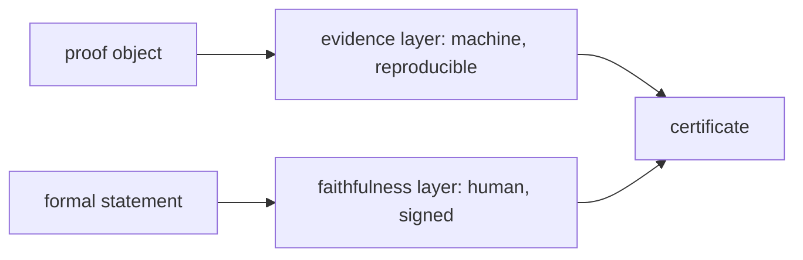

# A formal-verification certificate as a projection of signed state

Notes toward certificate design for [Project Diderot](https://projectdiderot.com),
July 2026. Diderot's principle is that only humans may issue certificates; AI
agents cannot self-certify. This describes a certificate that makes that
principle mechanical: a *view* of two layers a signed frontier already holds.



## Two layers, both authoritative

A formal-verification certificate for a problem is a projection of frontier
[`vfr_0a25edabc16db143`](https://erdos.constellate.science/method.html), joining:

| layer | what it holds | who is accountable | reproducible? |
|---|---|---|---|
| **evidence** (machine tier) | compiles, `sorry`-free, axiom set, and the Prop hypotheses the theorem takes as parameters | nobody; a machine computed it | yes, re-run the extractor |
| **faithfulness** (signed tier) | a named reviewer's verdict that the formal statement states the boxed problem | the reviewer, by Ed25519 signature | no; it is a signed judgment, verified by replay |

The two are independent axes, which is the whole reason to separate them. Only
one of the four combinations is a full solution, yet a single "formalised"
badge would mark three of them the same:

| | proof unconditional | proof conditional |
|---|---|---|
| **statement faithful** | solved | right problem, but the proof assumes something (Erdős 224) |
| **statement unfaithful / variant** | unconditional proof of the wrong statement (Erdős 214) | wrong statement *and* conditional proof |

The certificate shows both axes, so a reader sees which cell a claim is in.

## The evidence layer

The evidence layer is machine-computed facts about the proof object, from the
frozen multi-toolchain extractor (`lean/audit_feed*.json`, joined into
`site/verdicts.json`). It carries the axiom set, and the Prop hypotheses the
theorem takes as parameters. That last field is the one an axiom check does not
see: a proof can be `sorry`-free and `#print axioms`-clean and still prove its
goal only under a deep theorem passed in as a hypothesis. Every evidence record
names its own reproduction.

## The faithfulness layer

The frontier already holds these as signed events. A
[`statement.attested`](https://erdos.constellate.science/) event carries a
`StatementAttestation` (`vsa_`) with:

- `verdict`: `faithful`, `variant`, or `unfaithful` (a first-class negative
  result, not an absence);
- `attested_by`: a `reviewer:` identity. The substrate **refuses** an agent
  actor here and **requires** a reasoned note, so the kernel enforces "only
  humans may certify";
- `formal_ref` + `formal_statement_hash`: the exact statement bytes attested;
- `signature` + `signer_pubkey_hex`: an Ed25519 signature over the canonical
  body.

Because the signature is over pinned bytes, a reader does not trust the
certificate: they replay the log and verify it (`vela check . --strict`).

## Worked examples

All generated by [`certificate.py`](certificate.py) from live frontier state,
no hand-editing. The shape, abbreviated, from
[Erdős 224](certificates/erdos-224.certificate.json):

```jsonc
{
  "subject": { "problem": "Erdős 224", "frontier": "vfr_0a25edabc16db143" },
  "evidence": {                     // machine tier: reproducible, no human
    "verdict": "conditional",
    "hypothesis_parameters": ["hNo : Erdos224.NoObtuse A"],
    "reproduce": "python3 lean/extract_assumptions.py --repo plby"
  },
  "faithfulness": {                 // signed tier: a named human's judgment
    "verdict": "faithful",
    "attested_by": "reviewer:will-blair",
    "attestation_id": "vsa_923f442721de9905",
    "formal_statement_hash": "sha256:e0f4ceef…",
    "signature": "d71dffb9…",       // Ed25519 over the pinned statement bytes
    "verify": "vela check . --strict"
  }
}
```

**[Erdős 224](certificates/erdos-224.certificate.json)**: both layers on one
problem. Evidence `conditional`, because the theorem takes
`hNo : Erdos224.NoObtuse A` as a hypothesis parameter (kernel-clean on axioms,
so an axiom check alone would pass it). Faithfulness signed `faithful` by
`reviewer:will-blair`, `vsa_923f442721de9905`, with the real signature. The
statement is the right problem, and the proof holds only under an assumed
hypothesis.

**[Erdős 214](certificates/erdos-214.certificate.json)**: the axes pulling
apart. Evidence `unconditional`, faithfulness signed **`unfaithful`**. An
unconditional proof of a statement a reviewer signed as not stating the problem,
which a bare "formalised" badge would count as solved.

**[Erdős 997](certificates/erdos-997.certificate.json)**: evidence only.
Compiles and is `sorry`-free but depends on the axiom `maynardTaoBFT` (the
Maynard–Tao theorem, asserted), so `conditional`. No faithfulness attestation
on the frontier yet, and the certificate says so rather than implying one.

```
python certificate.py 224
```

## How this maps onto Diderot's certificates

- **Formal Verification** becomes the evidence layer: the machine facts, with a
  reproduce command, so it is checkable by anyone (including an agent). It says
  what the proof rests on, not just that it compiled.
- A **faithfulness** certificate is the signed layer: a named human's verdict
  that the formalisation states the problem. The [screening
  procedure](SCREENING.md) is one way to produce that judgment. This is where
  Diderot's "only humans certify" rule lives, and Vela already enforces it.
- Stopgap while a faithfulness layer is unbuilt: Formal Verification can
  honestly say "the result is formalised, but the formalisation does not
  necessarily follow the paper's argument."

## Provenance, stated honestly

The faithfulness layer is fully frontier-native: each is a real signed `vsa_`
event, verifiable by replay. The evidence layer is currently the frozen audit's
output rather than a signed frontier object. Vela has a first-class shape for
it too, a `VerifierAttachment` (`vva_`) whose `undischarged_hypotheses` field is
exactly the hypothesis-parameter list above; recording the audit's verdicts as
`vva_` attachments would make the evidence layer replayable frontier state on
the same footing as the signatures. That is the next step. An agent can produce
it, since the machine facts are reproducible and carry no judgment.
