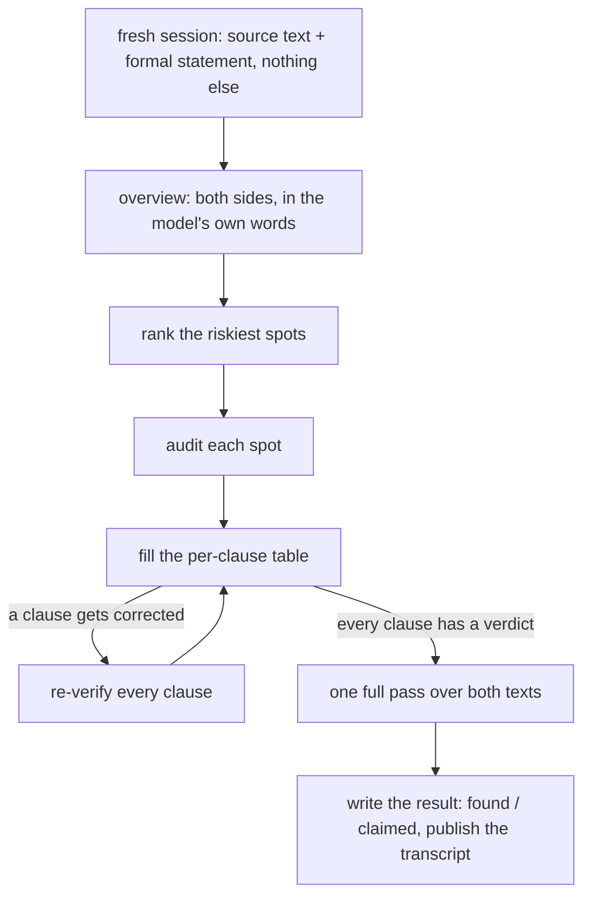

# The screening check, adapted to statements

Nat Sothanaphan screens claimed solutions at
[erdosproblems.com](https://www.erdosproblems.com/forum) with a structured,
model-assisted read: the transcript is always published, and the result is
reported as a screening rather than a verdict. This page writes that procedure
down and adapts it to a different target: whether a formal Lean statement
faithfully states the problem it names.

The procedure is reconstructed from his forum posts, so details may be off;
corrections welcome.

## Why statements need it

The Lean kernel checks proofs, and no part of the toolchain checks meaning.
A statement can elaborate, pass every linter, and still say something other
than the problem; when the miniF2F benchmark was re-audited
([arXiv:2511.03108](https://arxiv.org/abs/2511.03108)), over half of its
type-checking statements disagreed with their informal originals. A screening
of a solution claim also has a human referee behind it who will read the
proof anyway. A screening of a statement has no such backstop, so the
procedure has to carry more of the weight.

## The procedure

| step | rule | why |
|---|---|---|
| 1 | fresh model session, every time | a model sharing context with whoever produced the statement is convinced by its own reading |
| 2 | overview → rank the riskiest spots (quantifier order, hypothesis strength, definitional unfolding) → audit each → one full pass | ranking risks produces careful scrutiny; a "be adversarial" instruction produces hallucinated errors |
| 3 | per-clause table: every quantifier, hypothesis, and conclusion mapped to source text, one verdict per clause | mismatches hide in single clauses; after correcting any misreading, re-verify **every** clause |
| 4 | say the check "**found** no mismatch" or "**claimed** a mismatch in clause X", never "the statement is faithful" | positive error reports are themselves unverified claims |
| 5 | publish the transcript, with the standing disclaimer: a screening, not comprehensive, not a confirmation stamp | anyone can audit the prompt and the reasoning behind a verdict |

Statements are better targets for this than papers in one respect: they are
short and their clauses are enumerable, so the per-clause table can be
complete, and the length-dependent reliability decay that limits screening on
long writeups mostly disappears.

Two probes complement the read. In the
[Faithfulness Gap](https://arxiv.org/abs/2606.16541) measurements, LLM judges
comparing texts caught 63% of statement drift, and probes that act on the
statement caught about 90%:

- run a prover briefly against the statement *and its negation*: a genuinely
  open problem survives both, and a missing hypothesis usually doesn't.
  Boris Alexeev
  [ran Aristotle against Erdős 56](https://xenaproject.wordpress.com/2025/12/05/formalization-of-erdos-problems/)
  and a size-2 counterexample exposed the missing hypothesis;
- have a fresh model back-translate the Lean into English *without seeing
  the informal original*, then compare the two English statements.

## Running one

> [!IMPORTANT]
> Fresh session, every time. If the model has already seen the statement's
> authoring context, or its own earlier reading of it, start over.

1. Open a fresh session with a capable model. Paste the problem's source
   text (from erdosproblems.com or the cited paper, not the repo's
   docstring) and the formal statement. Nothing else; no PR discussion, no
   author notes.
2. Ask for an overview: what each side says, in the model's own words,
   before any comparison.
3. Ask it to rank the places most worth scrutinizing, then work through
   them one at a time.
4. Ask for the per-clause table and check it yourself as it fills in:

   | clause | source says | formal statement says | verdict |
   |---|---|---|---|
   | *each quantifier* | *quoted source text* | *the formal counterpart* | *found no mismatch, or claimed: …* |
   | *each hypothesis* | *…* | *…* | *…* |
   | *the conclusion* | *…* | *…* | *…* |

   If any clause gets corrected along the way, re-run the whole table.
5. One full pass over both texts, then write the result in found/claimed
   language and link the transcript. A posted result, in template form:

   > **Screening (statement fidelity), Erdős {N}.**
   > The check **found no mismatch** across {k} clauses,
   > *or* **claimed a mismatch** in {clause}: {one line on what differs}.
   > Transcript: {link}. A screening is not comprehensive and is not a
   > confirmation stamp.

A statement screening takes minutes; the artifact is short and has finitely
many clauses.

## Known failure modes

| failure mode | evidence | guard |
|---|---|---|
| the model confirms whatever artifact is in front of it | [BrokenMath](https://arxiv.org/abs/2510.04721): 29% sycophantic-proof rate, best model tested | ask what does *not* match, never "verify this is right" |
| independent runs share blind spots | [FrontierMath v2 audit](https://epoch.ai/frontiermath/the-benchmark): errors in 42% of problems that had passed human review | take the union of flags and have a human adjudicate each; no majority voting |
| circularity | models citing a site's own status as evidence a problem is open | the check reads the original source, never the repo's docstring |
| one clause corrected, the rest assumed fine | a screening that fixed one misread condition and never re-checked the condition it had already passed | step 3's re-verify-all rule |
| the formal proof silently repairs the informal argument | Erdős 650: the informal lower-bound proof had a gap; Aristotle's formalization fixed it in-flight, and the gap surfaced only in the authors' write-up ([thread 650](https://www.erdosproblems.com/forum/thread/650), Woett's timeline) | a Lean pass verifies the formal proof, never the informal argument; record known divergences as first-class state ([650's record](https://erdos.constellate.science/finding.html?n=650)) |

## What a screening never does

A screening never decides anything. In
[formal-conjectures](https://github.com/google-deepmind/formal-conjectures),
maintainer approval merges a statement. On
[erdos-frontier](https://erdos.constellate.science/method.html), a
statement-fidelity verdict exists only as a named reviewer's signed event.
The screening's output is provenance those decisions can cite.

First runs of this format: self-reviews on my own open formal-conjectures
statement PRs. The broader review-process context lives in
[STANDARD_CHECK.md](STANDARD_CHECK.md).
