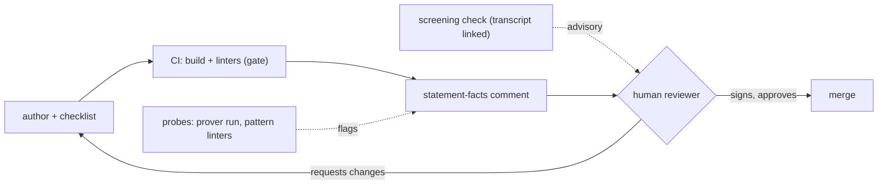

# A standard check for statement review

Working notes and a proposal, July 2026. None of this is built into
formal-conjectures yet; I'm collecting feedback from its maintainers first.
Discussion: [leanprover Zulip, #Formal conjectures](https://leanprover.zulipchat.com/#narrow/channel/524981-Formal-conjectures).

## The problem

Merging a conjecture statement into
[formal-conjectures](https://github.com/google-deepmind/formal-conjectures)
requires a maintainer to read it carefully against the source. Yaël Dillies
put numbers on it: about ten minutes per problem, a ~200-hour lower bound for
the Erdős corpus alone. The scarce resource is maintainer review cycles.
Every round trip spent on something a machine or the author could have caught
is a round trip not spent on the one judgment that needs a person: does the
formal statement say what the problem says?

Two observations shape everything below. Most review comments are repetitive.
Moritz Firsching: "pretty much what we write during review is repetitive and
should just be in a checklist for the Author or their agents to tick off."
And faithfulness is the one property the toolchain does not check. A
statement can elaborate, pass every linter, and be wrong by meaning; when the
miniF2F benchmark was re-audited
([arXiv:2511.03108](https://arxiv.org/abs/2511.03108)), over half of its
type-checking statements disagreed with their informal originals.

One rule sits under all of it, the same rule this repository's signed
frontier runs on: mechanical checks may gate, model output never does.
Machines report facts. A named human signs judgment.

## The shape of it

| layer | what it does | acts | can it block a merge? | status |
|---|---|---|---|---|
| author checklist | recurring review corrections, ticked off before review | author (or their agent) | no | open as [FC#4378](https://github.com/google-deepmind/formal-conjectures/pull/4378) |
| statement facts | one CI comment: attributes, status agreement, axiom/hypothesis audit of linked proofs | deterministic CI | no | proposed |
| behavioral probes | prover run + suspicious-pattern linters, flags only | deterministic CI | no | proposed |
| screening check | curated model-assisted per-clause review, transcript published | a person running a model | no | format documented below |
| signature | reads the mathematics, approves, signs | maintainer / named reviewer | **yes, the only thing that does** | unchanged |

Solid arrows are the gate path; dotted arrows only inform the human. Nothing
model-generated touches the solid path.

## The layers

**The author's checklist.** A "Before requesting review" section in
`FormalConjectures/ErdosProblems/README.md`, distilled from corrections that
recur in real reviews: quote erdosproblems.com verbatim instead of
paraphrasing, and for solved problems also quote the attribution sentence
below the box; search `FormalConjecturesForMathlib` and neighboring files
before defining anything; keep notes-to-reviewers in the PR description; give
new attribute behavior demo tests. Every line traces to a review comment on a
merged PR. Needs no infrastructure; the welcome bot already points
contributors at the README.

**Statement facts, computed in CI.** One sticky comment per ErdosProblems PR,
edited in place (mathlib's `PR_summary` pattern; a new comment per run is how
review bots get disabled). What it reports:

| fact | source |
|---|---|
| category, AMS tag, docstring per declaration | the repo's own linters, surfaced per-PR |
| does the file's category agree with erdosproblems.com's live status | `scripts/check_erdos_status.py`, already in the repo |
| for each `formal_proof` link: axiom set, sorry state, Prop hypotheses taken as parameters | the extractor behind this repository's audit and [FC#4368](https://github.com/google-deepmind/formal-conjectures/pull/4368) |

The mechanical half of a review, precomputed.
[FC#3973](https://github.com/google-deepmind/formal-conjectures/issues/3973)
asks for this class of metadata check in CI, and
[FC#4367](https://github.com/google-deepmind/formal-conjectures/pull/4367)
builds status-fixing on the same drift detector; this can be a surface those
efforts share.

**Behavioral probes.** Reading a statement against its source is the weak
check; acting on the statement is the strong one. When the
[Faithfulness Gap paper](https://arxiv.org/abs/2606.16541) measured LLM
judges on statement drift, they caught 63% of it; behavioral probing caught
about 90%. Two probes are worth having. Run a prover briefly against the
statement and against its negation: a genuinely open problem survives both,
while a statement missing a hypothesis usually does not. Boris Alexeev
[ran Aristotle against Erdős 56](https://xenaproject.wordpress.com/2025/12/05/formalization-of-erdos-problems/)
and a size-2 counterexample exposed the missing hypothesis. Second, extend
the repo's own suspicious-pattern linters: `ExistsImplicationLinter` and
`AnswerLinter` already catch two misformalization shapes at elaboration time,
and the same mold fits vacuous hypotheses and trivially-true goals. A probe
result is a flag for the reviewer, a reason to look and nothing more.

**The screening check.** For contested or high-stakes statements: the
procedure Nat Sothanaphan developed for solution claims on erdosproblems.com,
adapted to statement fidelity. I reconstructed it from his forum posts, so
corrections are welcome, his especially.

| step | rule | why |
|---|---|---|
| 1 | fresh model session, every time | a model sharing context with whoever produced the statement is convinced by its own reading |
| 2 | overview → rank the riskiest spots (quantifier order, hypothesis strength, definitional unfolding) → audit each → one full pass | triage produces adversarial attention; a "be adversarial" instruction produces hallucinated errors |
| 3 | per-clause table: every quantifier, hypothesis, and conclusion mapped to source text, one verdict per clause | mismatches hide in single clauses; after correcting any misreading, re-verify **every** clause |
| 4 | say the check "**found** no mismatch" or "**claimed** a mismatch in clause X", never "the statement is faithful" | positive error reports are themselves unverified claims |
| 5 | publish the transcript, with the standing disclaimer: a screening, not comprehensive, not a confirmation stamp | the verdict is auditable provenance, not an oracle |

And the failure modes have receipts:

| failure mode | evidence | guard |
|---|---|---|
| the model confirms the artifact in front of it | [BrokenMath](https://arxiv.org/abs/2510.04721): 29% sycophantic-proof rate, best model tested | ask what does *not* match, never "verify this is right" |
| independent runs share blind spots | [FrontierMath v2 audit](https://epoch.ai/frontiermath/the-benchmark): errors in 42% of problems that had passed human review | union of flags, human adjudicates each; no majority voting |
| circularity | models citing the site's own status as evidence the problem is open | the check reads the original source, never the repo's docstring |
| local matching without back-propagation | Nat's Chojecki case: one clause corrected, the already-passed clause never re-checked | step 3's re-verify-all rule |

**The signature.** Maintainer approval stays the only thing that merges a
statement. In this repository's terms, a statement-fidelity verdict exists
only as a named reviewer's signed event. None of the layers above signs
anything.

## The CI problem, measured

Review cycles include waiting for CI, and most of that wait buys a PR
nothing. `build-and-docs.yml` serves both PR validation and site deployment
with one job, so the deploy half runs on every PR even though only main
deploys. Step timings from two recent PR runs (28612552108 and 28608145267;
100 and 115 minutes total):

| step | time | needed for a PR? |
|---|---|---|
| `lake --wfail build` (the actual gate) | ~28 min | yes |
| Verso literate source pages | 52–53 min | no, deployed only from main |
| doc-gen documentation | 7–31 min, cache luck | no |
| growth plots, stats, website build, Pages artifact | ~5 min | no |

Roughly two thirds of every PR's CI builds artifacts the PR can never
deploy, and the workflow runs 100+ times a week.

Moritz is already attacking part of this:
[FC#4302](https://github.com/google-deepmind/formal-conjectures/pull/4302)
removes docgen outright, citing its build time. The run data says #4302 is
necessary but not sufficient for the PR lane. Verso literate is the dominant
per-PR cost at 52–53 minutes every run, docgen the smaller one, and
[FC#4306](https://github.com/google-deepmind/formal-conjectures/issues/4306)
would extend Verso to `FormalConjecturesForMathlib` and grow it. The two
changes compose: #4302 decides which doc artifacts exist, gating decides when
they build. With both, PR CI is about 30 minutes however docgen-versus-Verso
resolves.

Caching compounds it. The repository sits at GitHub's 10 GB cache ceiling
with LRU eviction, and every PR run saves olean and doc caches under
`refs/pull/N/merge`, a scope no other PR can read. Dozens of unreadable
PR-scoped entries evict the main-branch caches that every run actually
restores from, which fits both the 28-minute "incremental" build and the
7-versus-31-minute doc-build lottery.

The fix is two conditions, not a redesign: build the
literate/docs/website/artifact steps only off pull requests, and save caches
only from main while restoring everywhere. PR CI drops from ~100 to ~30
minutes, and the build step should fall further once main's caches stop being
evicted.

## Rollout

| phase | what | needs | decided by |
|---|---|---|---|
| 1 | README checklist ([FC#4378](https://github.com/google-deepmind/formal-conjectures/pull/4378), open) + screening-format self-reviews on my own open batch PRs | a read | do the artifacts save cycles? |
| CI split | gate deploy-only steps off PRs, save caches from main only | one workflow review; composes with [FC#4302](https://github.com/google-deepmind/formal-conjectures/pull/4302) | the run timings above |
| 2 | statement-facts comment behind a `statement-check` label, ~10 PRs | a label | review cycles per merged PR vs recent baseline |
| 3 | probes, one at a time | phase 2 paying for itself | a hit-rate ledger per probe |

Across all of it: a check earns its noise or it goes.

## Sources

Nat Sothanaphan's standard-check posts on the
[erdosproblems.com forum](https://www.erdosproblems.com/forum) (method,
verdict language, calibration retrospectives) ·
[mathlib PR_summary workflow](https://github.com/leanprover-community/mathlib4/blob/master/.github/workflows/PR_summary.yml) ·
[FC's linter framework](https://github.com/google-deepmind/formal-conjectures/tree/main/FormalConjectures/Util/Linters) ·
[Alexeev, "Formalization of Erdős problems"](https://xenaproject.wordpress.com/2025/12/05/formalization-of-erdos-problems/) ·
[miniF2F-Lean Revisited](https://arxiv.org/abs/2511.03108) ·
[The Faithfulness Gap](https://arxiv.org/abs/2606.16541) ·
[BrokenMath](https://arxiv.org/abs/2510.04721) ·
[FormalAlign](https://arxiv.org/abs/2410.10135) ·
[Epoch AI, FrontierMath v2 audit](https://epoch.ai/frontiermath/the-benchmark) ·
[leanprover-community/intentions](https://github.com/leanprover-community/intentions),
the claim/queue primitive if review ever becomes a claimable task board.
