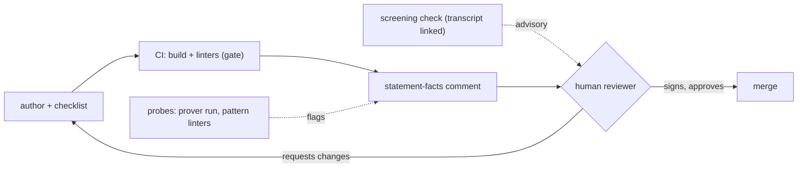
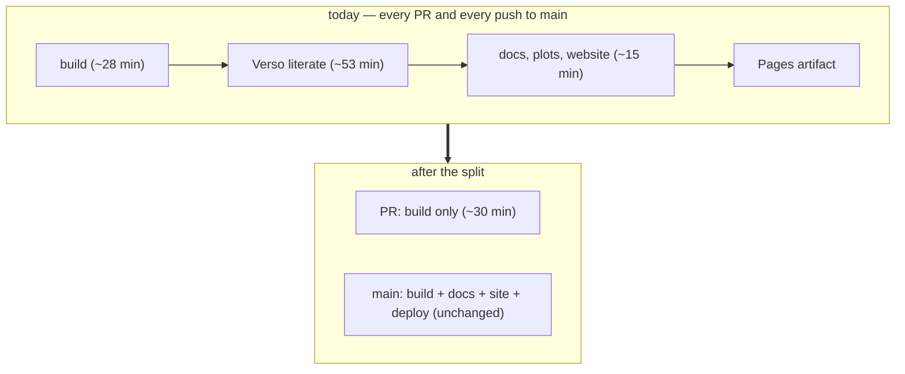

# A standard check for statement review

Working notes and a proposal, July 2026. None of this is built into
formal-conjectures yet; I'm collecting feedback from its maintainers first.
Discussion: [leanprover Zulip, #Formal conjectures](https://leanprover.zulipchat.com/#narrow/channel/524981-Formal-conjectures).

## The problem

Merging a conjecture statement into
[formal-conjectures](https://github.com/google-deepmind/formal-conjectures)
requires a maintainer to read it carefully against the source. A careful read
is about ten minutes per problem; across the Erdős corpus alone that is a
~200-hour lower bound. Reviewers currently spend many of those minutes on
things a machine or the author could have caught first, instead of on the one
question that actually needs a person: does the formal statement say what the
problem says?

Most review comments are repetitive; as Moritz put it, "pretty much
what we write during review is repetitive and should just be in a checklist
for the Author or their agents to tick off." Meanwhile faithfulness, the property
reviewers are really there to judge, is invisible to the toolchain. A
statement can elaborate, pass every linter, and still be wrong by meaning;
when the miniF2F benchmark was re-audited
([arXiv:2511.03108](https://arxiv.org/abs/2511.03108)), over half of its
type-checking statements turned out to disagree with their informal
originals.

The design rule throughout is the one this repository's signed frontier
already runs on: mechanical checks can gate, model output never does.
Machines report facts and a named human signs the judgment.

## Overview

| layer | what it does | run by | can it block a merge? | status |
|---|---|---|---|---|
| author checklist | recurring review corrections, ticked off before review | author (or their agent) | no | open as [FC#4378](https://github.com/google-deepmind/formal-conjectures/pull/4378) |
| statement facts | one CI comment: attributes, status agreement, axiom/hypothesis audit of linked proofs | deterministic CI | no | proposed |
| behavioral probes | prover run + suspicious-pattern linters, flags only | deterministic CI | no | proposed |
| screening check | model-assisted per-clause review, curated by a person, transcript published | a person running a model | no | format documented below |
| signature | reads the mathematics, approves, signs | maintainer / named reviewer | **yes, the only thing that does** | unchanged |

Solid arrows gate; dotted arrows only inform the reviewer.

## The layers

**The author's checklist.** A "Before requesting review" section in
`FormalConjectures/ErdosProblems/README.md`, collected from corrections that
keep coming up in review. Every line traces to a review comment on a merged
PR:

- [ ] docstrings quote erdosproblems.com verbatim, no paraphrasing
- [ ] solved problems also quote the attribution sentence below the box
- [ ] searched `FormalConjecturesForMathlib` and neighboring files before defining anything
- [ ] notes-to-reviewers live in the PR description, not the Lean file
- [ ] new attribute behavior comes with demo tests

It needs no infrastructure, and the welcome bot already points contributors
at the README.

**Statement facts, computed in CI.** One comment per ErdosProblems PR, edited
in place on each push (mathlib's `PR_summary` pattern; posting a new comment
per run is how review bots get disabled). What it reports:

| fact | source |
|---|---|
| category, AMS tag, docstring per declaration | the repo's own linters, surfaced per-PR |
| does the file's category agree with erdosproblems.com's live status | `scripts/check_erdos_status.py`, already in the repo |
| for each `formal_proof` link: axiom set, sorry state, Prop hypotheses taken as parameters | the extractor behind this repository's audit and [FC#4368](https://github.com/google-deepmind/formal-conjectures/pull/4368) |

This is the mechanical half of a review, done before the reviewer arrives.
[FC#3973](https://github.com/google-deepmind/formal-conjectures/issues/3973)
asks for the same class of metadata check in CI, and
[FC#4367](https://github.com/google-deepmind/formal-conjectures/pull/4367)
builds status-fixing on the same drift detector; all three could feed one
comment.

**Behavioral probes.** Asking a model to compare the statement with its
source catches less than trying to use the statement. When the
[Faithfulness Gap paper](https://arxiv.org/abs/2606.16541) measured LLM
judges on statement drift, they caught 63% of it; probes that act on the
statement caught about 90%. Two probes look worth having here:

| probe | what it exposes | precedent |
|---|---|---|
| run a prover briefly against the statement *and its negation* | a genuinely open problem survives both; a missing hypothesis usually doesn't | Boris Alexeev [ran Aristotle against Erdős 56](https://xenaproject.wordpress.com/2025/12/05/formalization-of-erdos-problems/); a size-2 counterexample exposed the missing hypothesis |
| suspicious-pattern linters | vacuous hypotheses, trivially-true goals | the repo's own `ExistsImplicationLinter` and `AnswerLinter` already catch two such shapes at elaboration time |

A probe result is a flag for the reviewer, not a verdict.

**The screening check.** For contested or high-stakes statements: the
procedure Nat Sothanaphan developed for solution claims on erdosproblems.com,
adapted to statement fidelity. I reconstructed it from his forum posts, so
corrections are welcome, especially from him.

| step | rule | why |
|---|---|---|
| 1 | fresh model session, every time | a model sharing context with whoever produced the statement is convinced by its own reading |
| 2 | overview → rank the riskiest spots (quantifier order, hypothesis strength, definitional unfolding) → audit each → one full pass | ranking risks produces careful scrutiny; a "be adversarial" instruction produces hallucinated errors |
| 3 | per-clause table: every quantifier, hypothesis, and conclusion mapped to source text, one verdict per clause | mismatches hide in single clauses; after correcting any misreading, re-verify **every** clause |
| 4 | say the check "**found** no mismatch" or "**claimed** a mismatch in clause X", never "the statement is faithful" | positive error reports are themselves unverified claims |
| 5 | publish the transcript, with the standing disclaimer: a screening, not comprehensive, not a confirmation stamp | anyone can audit the prompt and the reasoning behind a verdict |

Known ways this fails, and the guard for each:

| failure mode | evidence | guard |
|---|---|---|
| the model confirms whatever artifact is in front of it | [BrokenMath](https://arxiv.org/abs/2510.04721): 29% sycophantic-proof rate, best model tested | ask what does *not* match, never "verify this is right" |
| independent runs share blind spots | [FrontierMath v2 audit](https://epoch.ai/frontiermath/the-benchmark): errors in 42% of problems that had passed human review | take the union of flags and have a human adjudicate each; no majority voting |
| circularity | models citing the site's own status as evidence a problem is open | the check reads the original source, never the repo's docstring |
| one clause corrected, the rest assumed fine | Nat's Chojecki case: a fixed misreading, and the already-passed clause never re-checked | step 3's re-verify-all rule |

**The signature.** Maintainer approval stays the only thing that merges a
statement. In this repository's terms, a statement-fidelity verdict exists
only as a named reviewer's signed event. None of the layers above signs
anything.

## The CI problem, measured

Most of the time a PR spends waiting on CI buys it nothing.
`build-and-docs.yml` serves both PR validation and site deployment with one
job, so the deploy half runs on every PR even though only main deploys. Step
timings from two recent PR runs (28612552108 and 28608145267; 100 and 115
minutes total):

| step | time | needed for a PR? |
|---|---|---|
| `lake --wfail build` (the actual gate) | ~28 min | yes |
| Verso literate source pages | 52–53 min | no, deployed only from main |
| doc-gen documentation | 7–31 min, cache luck | no |
| growth plots, stats, website build, Pages artifact | ~5 min | no |

Roughly two thirds of every PR's CI goes to artifacts the PR can never
deploy, and the workflow runs 100+ times a week. Two workflow conditions fix
it, with no behavior change on main:

The second condition is about caching. The repository sits at GitHub's 10 GB
cache ceiling with LRU eviction, and every PR run saves olean and doc caches
under `refs/pull/N/merge`, a scope no other PR can read. Dozens of unreadable
PR-scoped entries evict the main-branch caches that every run actually
restores from, which would explain both the 28-minute "incremental" build and
the 7-versus-31-minute spread on doc builds. Saving caches only from main
(and restoring everywhere) should pull the build step down further.

Part of this is already in motion:
[FC#4302](https://github.com/google-deepmind/formal-conjectures/pull/4302)
removes docgen outright, citing its build time. It helps but doesn't fix the
PR lane on its own, since Verso literate is the dominant per-PR cost and
[FC#4306](https://github.com/google-deepmind/formal-conjectures/issues/4306)
would grow it. The two changes fit together: #4302 decides which doc
artifacts exist, gating decides when they build. With both, PR CI lands
around 30 minutes however the docgen-versus-Verso question resolves.

## Rollout

| phase | what | needs | decided by |
|---|---|---|---|
| 1 | README checklist ([FC#4378](https://github.com/google-deepmind/formal-conjectures/pull/4378), open) + screening-format self-reviews on my own open batch PRs | a read | do the artifacts save cycles? |
| CI split | gate deploy-only steps off PRs, save caches from main only | one workflow review; composes with [FC#4302](https://github.com/google-deepmind/formal-conjectures/pull/4302) | the run timings above |
| 2 | statement-facts comment behind a `statement-check` label, ~10 PRs | a label | review cycles per merged PR vs recent baseline |
| 3 | probes, one at a time | phase 2 paying for itself | a hit-rate ledger per probe |

Any check that keeps flagging things nobody acts on gets removed.

## Sources

Nat Sothanaphan's standard-check posts on the
[erdosproblems.com forum](https://www.erdosproblems.com/forum) (method,
verdict language, calibration retrospectives) ·
[mathlib PR_summary workflow](https://github.com/leanprover-community/mathlib4/blob/master/.github/workflows/PR_summary.yml) ·
[FC's linter framework](https://github.com/google-deepmind/formal-conjectures/tree/main/FormalConjectures/Util/Linters) ·
[Alexeev, "Formalization of Erdős problems"](https://xenaproject.wordpress.com/2025/12/05/formalization-of-erdos-problems/) ·
[miniF2F-Lean Revisited](https://arxiv.org/abs/2511.03108) ·
[The Faithfulness Gap](https://arxiv.org/abs/2606.16541) ·
[BrokenMath](https://arxiv.org/abs/2510.04721) ·
[FormalAlign](https://arxiv.org/abs/2410.10135) ·
[Epoch AI, FrontierMath v2 audit](https://epoch.ai/frontiermath/the-benchmark) ·
[leanprover-community/intentions](https://github.com/leanprover-community/intentions),
the claim/queue primitive if review ever becomes a claimable task board.
